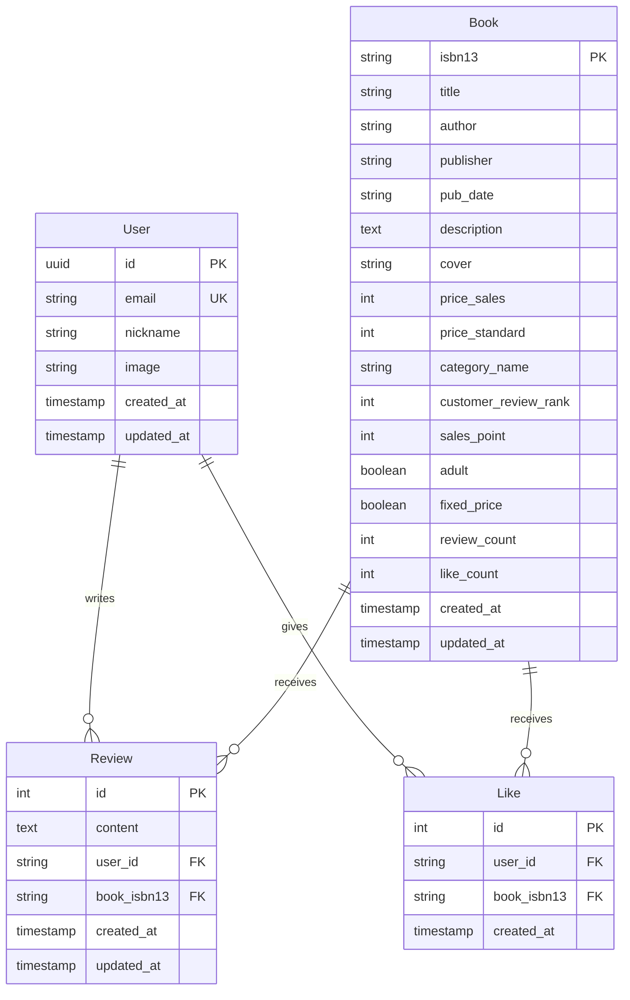

# 📚 Today Book Server

> **도서 리뷰 및 추천 서비스 백엔드 API 서버**  
> 알라딘 도서 API와 카카오 OAuth를 활용한 개인화된 도서 추천 플랫폼


---

## 🎯 프로젝트 개요

**Today Book Server**는 독서 문화를 촉진하고 개인화된 도서 추천을 제공하는 웹 서비스의 백엔드 시스템입니다. 
알라딘 도서 API와 연동하여 실시간 도서 데이터를 제공하며, 사용자 리뷰와 좋아요 데이터를 기반으로 한 추천 알고리즘을 구현했습니다.

### 🚀 주요 성과
- **외부 API 연동**: 알라딘 도서 API와 안정적인 연동 구현
- **소셜 로그인**: 카카오 OAuth 2.0 기반 인증 시스템 구축 (API 최적화 적용)
- **추천 시스템**: 평점, 판매량, 출간일 등을 고려한 도서 추천 로직 개발
- **확장 가능한 아키텍처**: NestJS 모듈 시스템을 활용한 체계적인 코드 구조

---

## ✨ 핵심 기능

### 🔐 **사용자 인증 시스템**
- **카카오 OAuth 2.0** 기반 소셜 로그인
- **JWT 쿠키** 방식의 안전한 세션 관리
- ID 토큰 디코딩을 통한 사용자 정보 추출

### 📖 **도서 검색 및 조회**
- **실시간 도서 검색**: 키워드 기반 도서 검색
- **도서 상세 정보**: ISBN13 기반 도서 정보 조회
- **캐싱 시스템**: 데이터베이스 저장을 통한 성능 최적화

### 💡 **추천 시스템**
- **다중 요소 분석**: 고객 평점, 판매량, 출간일 기반 스코어링
- **랜덤 요소 추가**: 다양성 확보를 위한 추천 알고리즘
- **오늘의 책**: 점수기반 상위 5권 선별 추천

### 📝 **리뷰 시스템**
- **CRUD 완전 구현**: 리뷰 작성, 조회, 수정, 삭제
- **중복 방지**: 사용자당 도서별 1개 리뷰 제한
- **페이지네이션**: 대용량 데이터 효율적 처리
- **사용자 권한 관리**: 본인 리뷰만 수정/삭제 가능

### 💗 **좋아요 시스템**
- **중복 방지**: 사용자당 도서별 1회 좋아요 제한
- **실시간 반영**: 좋아요 상태 즉시 확인 가능
- **통계 제공**: 도서별 좋아요 수 조회 기능

---

## 🛠️ 기술 스택

### **Backend Framework**
- **NestJS**: 확장 가능한 Node.js 프레임워크
- **TypeScript**: 타입 안정성과 개발 효율성 확보

### **Database & ORM**
- **PostgreSQL**: 관계형 데이터베이스
- **TypeORM**: 타입 안전한 ORM 라이브러리

### **Authentication & Security**
- **JWT**: JSON Web Token 기반 인증
- **카카오 OAuth**: 직접 구현한 카카오 로그인
- **Cookie-Parser**: 안전한 쿠키 관리

### **External API Integration**
- **Axios**: HTTP 클라이언트 라이브러리
- **알라딘 도서 API**: 실시간 도서 데이터

### **Development Tools**
- **Biome**: 코드 포맷팅 및 린팅
- **Insomnia**: API 테스트

---

## 🏗️ 아키텍처 설계

### **모듈 구조**
```
src/
├── auth/           # 카카오 OAuth 인증
├── users/          # 사용자 관리
├── books/          # 도서 검색 및 조회
├── reviews/        # 리뷰 시스템
├── likes/          # 좋아요 기능
├── jwt-cookie/     # JWT 쿠키 관리
└── app/            # 애플리케이션 루트
```

### **데이터베이스 스키마**


---

## 🔧 핵심 기술 구현

### **1. 카카오 OAuth 인증 플로우**
```typescript
// ID 토큰 디코딩 및 사용자 정보 추출 (현재 구현)
private decodeKakaoIdToken(idToken: string): KakaoIdTokenPayloadDto {
    const base64Url = idToken.split('.')[1];
    const decodedPayloadBuffer = Buffer.from(base64Url, 'base64url');
    return JSON.parse(decodedPayloadBuffer.toString('utf-8'));
}

// 최적화 성과: Access Token으로 추가 API 호출 대신 ID Token 활용
// 현재 한계점:
// 1. JWT 서명 검증 없음 - 보안상 위험
// 2. Refresh Token을 통한 토큰 갱신 로직 없음
```

### **2. 추천 알고리즘 구현**
```typescript
private applyRecommendationAlgorithm(books: AladinBookItemDto[]): AladinBookItemDto[] {
    const scoredBooks = books.map((book) => {
        let score = 0;
        
        // 고객 평점 가중치 (40점)
        if (book.customerReviewRank) {
            score += (book.customerReviewRank / 10) * 40;
        }
        
        // 판매량 가중치 (30점)
        if (book.salesPoint) {
            score += Math.min(book.salesPoint / 1000, 1) * 30;
        }
        
        // 출간일 최신성 가중치 (20점)
        // 랜덤 요소 (10점) - 다양성 확보
        
        return { ...book, recommendationScore: score };
    });
    
    return scoredBooks
        .sort((a, b) => b.recommendationScore - a.recommendationScore)
        .slice(0, 5);
}
```

### **3. 데이터베이스 최적화**
```typescript
// 도서 정보 캐싱 전략
async findOne(isbn: string, userId?: string) {
    // 1. DB에서 캐시된 데이터 조회
    let book = await this.findBookByIsbn(isbn);
    
    if (!book) {
        // 2. 외부 API 호출 및 DB 저장
        const response = await this.httpService.axiosRef.get(fullUrl);
        book = await this.saveBookFromAladin(response.data.item[0]);
    }
    
    // 3. 사용자별 좋아요 상태 확인
    const isLiked = userId ? await this.likesService.isLikedByUser(userId, isbn) : false;
    
    return this.mapBookToResponseDto(book, isLiked);
}
```

---

## 📊 API 명세서

### **인증 관련**
- `GET /auth/kakao` - 카카오 로그인 페이지 리다이렉트
- `GET /auth/kakao/callback` - 카카오 OAuth 콜백 처리

### **도서 관련**
- `GET /books/search` - 도서 검색 (키워드, 카테고리, 정렬)
- `GET /books/:isbn13` - 도서 상세 정보 조회
- `GET /books` - 도서 목록 조회 (베스트셀러, 신간, 추천)

### **리뷰 시스템**
- `POST /reviews/:isbn13` - 리뷰 작성 🔒
- `GET /reviews/:isbn13` - 도서별 리뷰 조회 (페이지네이션)
- `PATCH /reviews/:isbn13` - 리뷰 수정 🔒
- `DELETE /reviews/:isbn13` - 리뷰 삭제 🔒

### **좋아요 시스템**
- `POST /likes/:isbn13` - 좋아요 추가 🔒
- `DELETE /likes/:isbn13` - 좋아요 취소 🔒
- `GET /likes/book/:isbn13/count` - 도서별 좋아요 수 조회

🔒 **인증 필요 API**

---

## 🚀 실행 방법

### **1. 데이터베이스 설정 (Docker)**
```bash
# PostgreSQL 컨테이너 실행
docker run --name docker-postgres \
  -e POSTGRES_PASSWORD=postgres \
  -p 5432:5432 \
  -d postgres

# 컨테이너 상태 확인
docker ps
```

### **2. 환경 설정**
```bash

#.env.local

# 필수 환경변수 설정
PORT=3000
DB_HOST=localhost
DB_PORT=5432
DB_USERNAME=postgres
DB_PASSWORD=postgres
DB_DATABASE=today_book

JWT_SECRET=your_jwt_secret_key
KAKAO_CLIENT_ID=your_kakao_client_id
KAKAO_CLIENT_SECRET=your_kakao_client_secret
ALADIN_TTB_KEY=your_aladin_api_key
```

### **3. 설치 및 실행**
```bash
# 의존성 설치
pnpm install

# 개발 서버 실행 (TypeORM 자동 동기화 사용)
pnpm run start:dev
```

---

## 📈 성과 및 배운 점

### **기술적 성과**
- ✅ **외부 API 연동**: 알라딘 API와 안정적인 통신 구현
- ✅ **인증 시스템**: 카카오 OAuth 2.0 구현 (API 최적화 완료, 보안 검증 개선 필요)
- ✅ **데이터베이스 설계**: 효율적인 관계형 스키마 설계
- ✅ **추천 시스템**: 다중 요소 기반 추천 로직 개발

### **개발 경험**
- 🔧 **모듈화**: NestJS 모듈 시스템을 활용한 체계적인 코드 구조
- 🔧 **타입 안정성**: TypeScript와 Class-validator를 통한 런타임 안정성
- 🔧 **API 설계**: RESTful API 설계 원칙 준수
- 🔧 **성능 최적화**: 불필요한 API 호출 제거를 통한 응답 속도 개선
- 🔧 **보안 인식**: OAuth 토큰 검증의 중요성과 한계점 파악
- 🔧 **테스트 전략**: Insomnia를 활용한 체계적인 API 테스트

### **현재 한계점 및 개선 방향**

#### **🔧 현재 한계점**
- **ID 토큰 검증 미구현**: 카카오 ID 토큰을 단순 디코딩만 수행 (JWT 서명 검증 없음)
- **토큰 활용 부족**: Access Token, Refresh Token을 받지만 갱신 로직 미구현
- **보안 검증 누락**: API 호출 최적화는 했지만 ID 토큰 서명 검증 단계 생략

#### **🎯 향후 개선 방향**
- 🔐 **토큰 보안 강화**: ID 토큰 서명 검증 구현 및 Refresh Token 활용
- 🎯 **실시간 알림**: WebSocket 기반 실시간 리뷰 알림
- 🎯 **검색 최적화**: Elasticsearch를 활용한 고성능 검색
- 🎯 **캐싱 전략**: Redis 기반 캐싱 레이어 구현
- 🎯 **추천 고도화**: 사용자 행동 데이터 기반 개인화 추천 시스템

---

## 📞 문의 및 피드백

프로젝트에 대한 질문이나 개선 제안이 있으시면 언제든지 연락주세요.

**Portfolio**: [GitHub Profile](https://github.com/jnghwn99)  
**Email**: jnghwn99@gmail.com

---

## 📄 라이선스

이 프로젝트는 **MIT 라이선스** 하에 공개되어 있습니다.

---

*"독서는 정신의 양식이다. 좋은 책과의 만남을 도와주는 플랫폼을 만들고 싶었습니다."*
